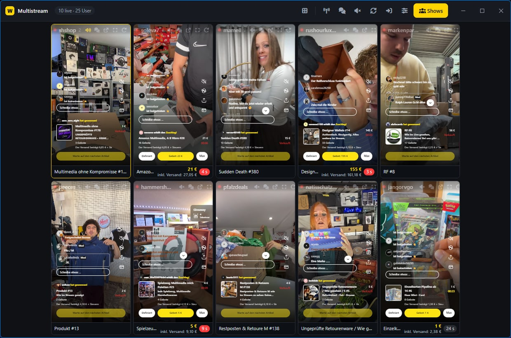
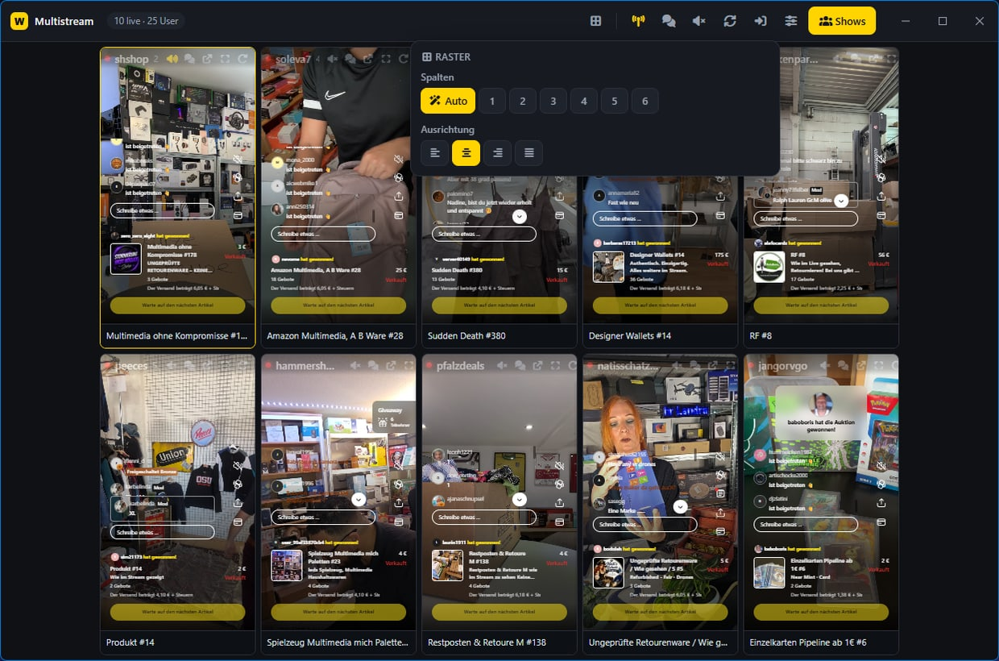
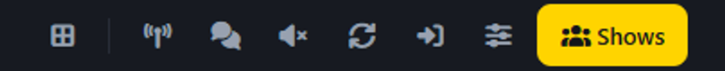
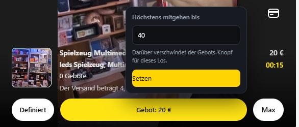
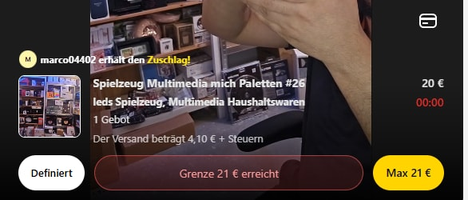
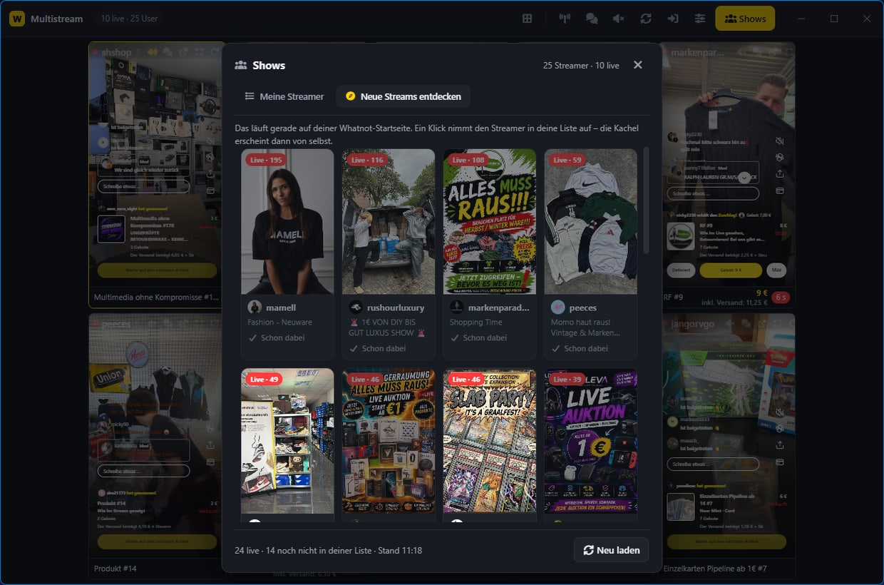
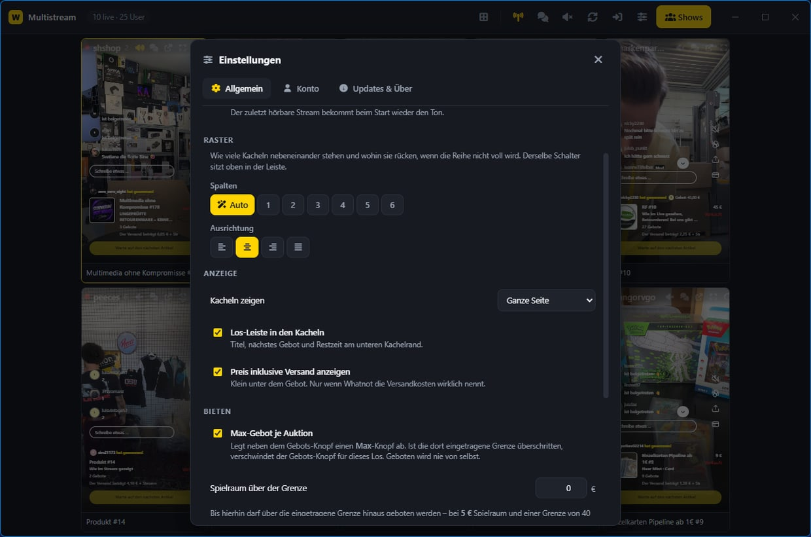

<div align="center">


# Whatnot Multistream

**Bis zu 20 Whatnot-Shows gleichzeitig in einem Fenster.**

Du trägst *Streamer* ein, keine Streams. Die App schaut nach, wer davon gerade live ist, und holt die laufende Show von selbst ins Raster. Ist die Show vorbei, ist die Kachel weg.

[](https://github.com/zqqqqx/whatnot-multistream/releases/latest) [](https://github.com/zqqqqx/whatnot-multistream/releases)  [](LICENSE)



</div>

---

## Was du davon hast

- **Alles auf einen Blick.** Zehn Schnäppchenjäger gleichzeitig, statt zwischen Tabs zu springen.
- **Kein Verpassen.** Geht jemand live, erscheint die Kachel von selbst.
- **Der echte Preis.** Unter jedem Gebot steht, was es **mit Versand** kostet.
- **Eine Bremse beim Bieten.** Setz dir pro Auktion eine Grenze – darüber verschwindet der Gebots-Knopf.
- **Ton nur einmal.** Immer genau ein Stream ist hörbar, ein Klick schaltet um.

## Installieren

1. Unter [**Releases**](https://github.com/zqqqqx/whatnot-multistream/releases/latest) die Datei `Whatnot-Multistream-Setup-x.y.z.exe` laden.
2. Doppelklick. Es braucht **keine Administratorrechte**.
3. Windows warnt beim ersten Start (die Datei ist nicht signiert): *Weitere Informationen* → *Trotzdem ausführen*.

Updates meldet die App selbst – oben erscheint ein gelber Knopf. Geladen wird erst auf Klick.

## Die ersten Minuten

Beim ersten Start führt dich ein kurzer Assistent durch genau diese vier Schritte:

| | |
| --- | --- |
| **1. Anmelden** | Ohne Anmeldung zeigt Whatnot nur ein Vorschaubild. Die Anmeldung läuft in einem eigenen Fenster **direkt bei Whatnot** – die App sieht dein Passwort nie. |
| **2. Name erkannt** | Deinen Whatnot-Namen liest die App selbst aus. Eintippen musst du nichts. |
| **3. Streamer eintragen** | Namen ins Feld, mehrere mit Komma getrennt. Profil-Links gehen auch. |
| **4. Fertig** | Ab jetzt läuft es allein. |

Du kannst jederzeit abbrechen – beim nächsten Start geht es an derselben Stelle weiter,
und über *Einstellungen → Setup erneut starten* kommst du wieder hin.

## Bedienen



Die Kopfleiste **ist die Titelleiste** – ziehen, Doppelklick maximiert. Rechts sitzen die
Symbole, von links nach rechts:



| Symbol | Was es tut |
| --- | --- |
| **Raster** | Spalten (Auto oder 1–6) und Ausrichtung (links, Mitte, rechts, verteilt). |
| **Sendeturm** | Sofort nachsehen, wer live ist – statt auf die nächste Runde zu warten. |
| **Sprechblase** | Alle Kacheln umschalten: ganze Seite → ohne Chat → nur Video. |
| **Lautsprecher** | Alles stummschalten. |
| **Kreispfeile** | Alle Kacheln neu laden. |
| **Pfeil in die Tür** | Anmelden oder Konto wechseln. Leuchtet gelb, solange ein Konto erkannt ist. |
| **Schieberegler** | Einstellungen. |
| **Shows** | Streamer verwalten und neue entdecken. |

Ein **durchgestrichenes Auge** kommt links dazu, sobald versteckte Streamer live sind –
mit einer Zahl, wie viele.

Und an der Kachel selbst:

- **Vergrößern** zeigt eine Show in voller Größe mit Shop und Gebots-Knöpfen. **Nur dort lässt sich bieten.** Zurück mit `Esc`.
- **Rechtsklick** öffnet das Menü. **Rechtsklick halten und ziehen** sortiert die Kacheln um.
- Klick auf den **Lautsprecher** holt den Ton zu dieser Kachel.

> Whatnots eigene Kopfzeile über dem Video – Profilbild, Name, Bewertung, „Folgen",
> Zuschauerzahl – ist ausgeblendet. Das steht in der Kachelleiste schon.

## Max-Gebot

Neben dem gelben Gebots-Knopf sitzt ein zweiter: **Max**. Dort trägst du ein, bis wohin du
bei *diesem* Los mitgehen willst.

<table>
<tr>
<td width="50%"></td>
<td width="50%"></td>
</tr>
<tr>
<td>Grenze eintragen …</td>
<td>… und darüber ist der Gebots-Knopf weg.</td>
</tr>
</table>

**Geboten wird nie von selbst.** Die App liest den Gebots-Knopf und blendet ihn aus –
gedrückt wird er unter keinen Umständen. Das ist also *kein* Bietagent, sondern eine
Bremse gegen den eigenen Klickfinger. Mit dem nächsten Los fängt alles wieder von vorn an.

In *Einstellungen → Bieten* lässt sich das abschalten und ein **Spielraum** setzen:
bei 5 € Spielraum und einer Grenze von 40 € bleibt der Knopf bis 45 € stehen.

## Neue Streams entdecken



Der zweite Reiter im Shows-Fenster zeigt, was gerade auf **deiner** Whatnot-Startseite läuft –
mit Vorschaubild, Titel und Zuschauerzahl, nach Zuschauern sortiert. Ein Klick nimmt den
Verkäufer in deine Liste auf, die Kachel erscheint dann von selbst.

## Preis inklusive Versand

Am unteren Kachelrand steht, was gerade unter dem Hammer ist: Titel, nächstes Gebot,
Restzeit – und klein darunter der Preis **mit Versand**. Gerechnet wird nur mit dem, was
auf der Seite steht; nennt Whatnot keine Versandkosten, steht dort auch nichts.

Dazu kommt ein Kniff, den man leicht übersieht: Whatnot bündelt den Versand pro Verkäufer
und Tag. Hast du dort heute schon etwas ersteigert, kostet das nächste Los **keinen zweiten
Versand** – die Kachel bekommt dann ein LKW-Symbol, und die Summe rechnet ohne Versand weiter.

## Einstellungen



Drei Reiter: **Allgemein** (Start, Raster, Anzeige, Bieten, Maßstab), **Konto** (erkannter
Name, anmelden, Konto wechseln) und **Updates & Über**.

Der Regler **Maßstab im Raster** ist der interessanteste: Er entscheidet, wie viel von
Whatnots Oberfläche in eine Kachel passt. Nach links wird die Seite größer gezeigt – mehr
Videobild, weniger Chat. Nach rechts umgekehrt.

---

# Unter der Haube

Ab hier wird es technisch. Für die Benutzung brauchst du davon nichts.

<details>
<summary><b>Warum eine App und keine Webseite?</b></summary>

Whatnot verbietet das Einbetten seiner Seiten in fremde Webseiten
(`X-Frame-Options: SAMEORIGIN`). Im Browser lässt sich deshalb nichts bauen, das mehrere
Streams nebeneinander zeigt. Diese App bettet sie nicht ein, sondern öffnet sie als
eigenständige Browser-Fenster im selben App-Fenster (Electron `<webview>`) – dafür gilt die
Sperre nicht.

</details>

<details>
<summary><b>Wie die App merkt, wer live ist</b></summary>

Eine Profilseite listet laufende **und** nur geplante Shows nebeneinander auf – der Link
allein sagt also nichts. Die App liest deshalb den Status aus den Daten, die in der Seite
mitgeliefert werden: `PLAYING` wird geöffnet, `CREATED` ignoriert. Fällt dieser Weg aus,
erkennt sie die laufende Show am roten **Live**-Aufkleber.

Geprüft wird alle zwei Minuten, ein Profil nach dem anderen, damit Whatnot nicht mit
Anfragen überschüttet wird. Das läuft in einem unsichtbaren Whatnot-Fenster im Hintergrund –
Anmeldung und Herkunft gelten dort wie bei einem normalen Besuch.

</details>

<details>
<summary><b>Wenn eine Show endet</b></summary>

Auf die nächste Runde zu warten hieße, dass eine beendete Show noch bis zu zwei Minuten mit
stehendem Bild herumhängt. Die Kachel sieht es früher – sie hat drei Anzeichen:

1. die Adresse ist keine Show-Adresse mehr,
2. der Player ist weg,
3. das Bild steht seit 15 Sekunden.

Entschieden wird in der Kachel aber nichts. Sie meldet nur einen **Verdacht**, und die App
holt daraufhin die Profilseite – die einzige Stelle, die es sicher weiß. Ein Fehlalarm
kostet damit eine Abfrage und sonst nichts. Vom Stillstand bis zur Nachfrage: **rund 20
Sekunden**.

</details>

<details>
<summary><b>Warum die Kacheln hochkant sind</b></summary>

Whatnot sendet im Handy-Format, und im schmalen Fenster zeigt die Seite ihr Handy-Layout mit
Video **und** Chat übereinander. Genau das passt in eine Kachel, ohne dass schwarze Ränder
bleiben.

Jede Kachel zeigt die Seite dabei mit immer **derselben logischen Breite** – die Kachelgröße
bestimmt nur den Maßstab. Dadurch bleibt das Verhältnis von Chat zu Videobild überall
gleich: Bei wenigen großen Kacheln wird der Chat einfach größer, statt dass Whatnot auf ein
breiteres Layout umschaltet. Wie breit gezeichnet wird, stellt der Regler *Maßstab im
Raster* ein.

Das Raster rechnet in beiden Fällen gleich: Gesucht wird die Größe, bei der alle Kacheln
zugleich ins Fenster passen. Nur wenn sie dabei unter 190 Pixel fielen, füllen sie die
Spaltenbreite und es wird gescrollt.

</details>

<details>
<summary><b>Anmeldung und Namenserkennung</b></summary>

Passwörter sieht die App nie – die Anmeldung läuft in einem eigenen Fenster direkt bei
Whatnot. Erkannt wird nur, *dass* sie geklappt hat, und *wer* angemeldet ist.

Whatnot legt den angemeldeten Nutzer in jede Seite, aber **nur beim echten Seitenaufruf**;
eine Hintergrundabfrage derselben Adresse bekommt die Daten nicht mit, auch angemeldet
nicht. Gelesen wird deshalb an einer anderen Stelle: Whatnot legt dieselben Angaben in den
lokalen Speicher der Domain, und der ist auch auf der `robots.txt` lesbar, auf der der
Prüfhelfer ohnehin parkt. Das kostet **keine einzige Anfrage** und ist in Millisekunden da –
auch direkt nach einem Update, denn die Anmeldung überlebt es.

Steht dort nichts, gibt es einen zweiten, langsameren Weg. Der wird nur beschritten, wenn
die Cookies überhaupt eine Anmeldung nahelegen.

</details>

<details>
<summary><b>Die Beitritts-Meldung – und warum sie geschlossen statt versteckt wird</b></summary>

Beim Betreten einer Show wirft Whatnot „Herzlich Willkommen! Du nimmst an einer Show von …
teil" hoch. Bei einer Wand aus Kacheln erscheint die reihum in jeder einzelnen, deshalb wird
sie unterdrückt – aber **nur diese eine**, erkannt am Wortlaut. Fehlermeldungen und
Gebotshinweise bleiben stehen.

Der Haken: Whatnot zeigt sie teils als modalen Dialog. Solange so einer offen ist, erklärt
der Browser den **ganzen Rest der Seite** für unbedienbar. Ihn nur zu verstecken nimmt ihm
das nicht – er wäre dann unsichtbar *und* nicht mehr wegzuklicken, und in der Kachel ließe
sich nirgends mehr klicken, auch nicht in der Großansicht. Er wird deshalb **geschlossen**.

Als Notbremse gilt dasselbe für jeden offenen modalen Dialog, der nichts zeichnet, egal wer
ihn aufstellt: unsichtbar sein *und* jede Eingabe sperren ergibt keinen sinnvollen Zustand.

</details>

<details>
<summary><b>Ausgeschlossene Konten</b></summary>

Bestimmte Whatnot-Konten können von der Nutzung ausgeschlossen werden. Die Liste enthält
**keine Klarnamen**, sondern nur den SHA-256-Abdruck des normalisierten Usernamens – wer sie
in die Hände bekommt, erfährt daraus nicht, um wen es geht.

Sie liegt **im Netz, nicht in der App**: Läge sie im Installer, griffe eine Sperre erst,
wenn der Betroffene freiwillig aktualisiert – und genau das wird er nicht tun. Stattdessen
fragt jeder Client alle 30 Minuten nach.

Jemanden sperren:

```bash
node tools/ban-hash.js <username>     # Abdruck bilden
```

Den Abdruck in [`banned-users.json`](banned-users.json) unter `hashes` eintragen, fertig.
Streichen hebt die Sperre auf demselben Weg wieder auf.

Geprüft wird **beim Start, bevor die erste Show geöffnet wird** – ein gesperrtes Konto
bekommt keine Sekunde lang Streams zu sehen. Wer nicht gesperrt ist, merkt davon nichts:
Das Ganze ist in gut einer halben Sekunde erledigt.

</details>

<details>
<summary><b>Was gespeichert wird – und was nicht</b></summary>

Alles liegt lokal in einer Datei im Datenordner der App:

| Was | |
| --- | --- |
| Streamerliste, Reihenfolge, versteckt-Markierung | je Streamer |
| Ansicht je Kachel (ganze Seite / ohne Chat / nur Video) | je Streamer |
| Raster, Ansicht für alle, alle Schalter der Einstellungen | allgemein |
| Erkanntes Konto, zuletzt geholte Sperrliste | schreibt der Hauptprozess |
| Fenstergröße und -lage, welcher Stream Ton hat | |
| Versand-Merker | je Streamer, gilt für den laufenden Tag |

**Nicht** gespeichert wird: dein Passwort (sieht die App nie) und irgendetwas auf einem
fremden Server. Die App spricht mit genau zwei Gegenstellen: whatnot.com und GitHub
(Updates und Sperrliste).

</details>

<details>
<summary><b>Selbst starten und bauen</b></summary>

```bash
npm start          # aus dem Quelltext starten
npm run dist       # Installer nach dist/ bauen
```

Die installierte Fassung und `npm start` teilen sich denselben Datenordner – die
Streamerliste ist in beiden dieselbe.

Für eine neue Fassung: Version in der `package.json` erhöhen, bauen, und **alle drei
Dateien** aus `dist/` (Installer, `latest.yml`, `.blockmap`) an ein GitHub-Release mit dem
Tag `v<version>` hängen. Genau danach sucht die Selbstaktualisierung.

</details>

## Grenzen

- **Ohne Anmeldung** legt Whatnot in jeder Kachel ein Anmeldefenster über den Stream.
- **20 Streams sind viel Last** – jede Kachel ist ein eigener Browser-Prozess mit laufendem
  Video. Bei Rucklern: Streamer verstecken, die laufen dann gar nicht erst mit.
- **Bis zu zwei Minuten Verzögerung**, bis eine neu gestartete Show auftaucht. Der
  Sendeturm oben holt sie sofort.
- Ändert Whatnot Seitenaufbau und Datenformat zugleich, fällt die Live-Erkennung aus. In der
  Shows-Liste steht dann *Prüfung fehlgeschlagen* mit dem Grund.

## Lizenz

[AGPL-3.0-or-later](LICENSE). Kein offizielles Whatnot-Produkt und nicht mit Whatnot
verbunden – „Whatnot" gehört Whatnot Inc.

Die Bildschirmfotos zeigen öffentlich gesendete Shows zum Zeitpunkt der Aufnahme.
